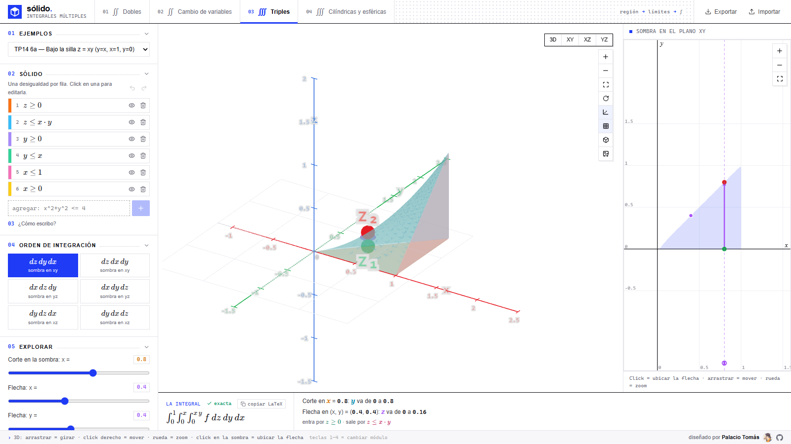
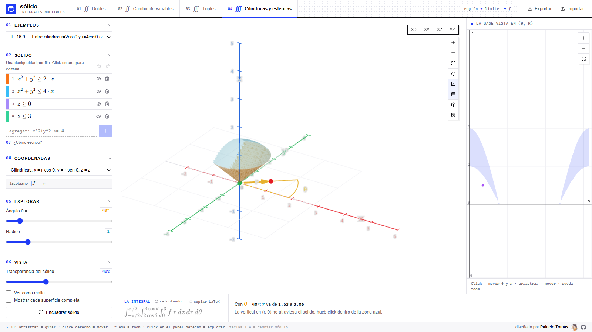
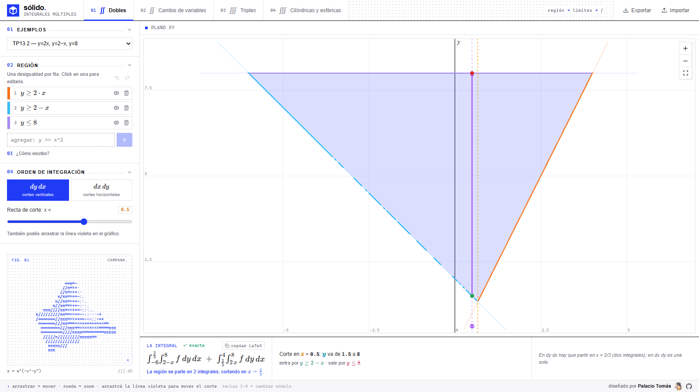
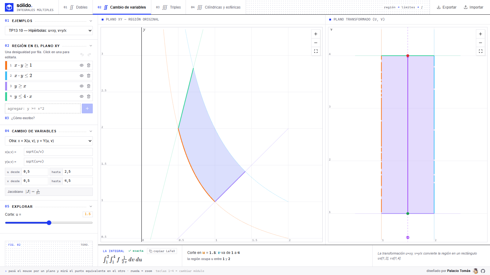

<div align="center">

# sólido.

**Graficadora 3D para integrales múltiples — hecha para hacer trabajos prácticos**

Cargás las fronteras de la región como desigualdades y la app dibuja la región o el sólido,
muestra la sombra en el plano, los barridos y **planta la integral iterada con límites exactos**
(verificados numéricamente, no solo dibujados).

`React 19 · Vite · TypeScript · Tailwind v4 · three.js · KaTeX · Web Workers`

</div>

---

## Módulos

| # | Módulo | Qué hace |
|---|--------|----------|
| 01 | **Dobles · Cartesianas** | Regiones en el plano, barrido vertical (`dy dx`) u horizontal (`dx dy`), cortes arrastrables. |
| 02 | **Dobles · Cambio de variable** | Polares, elípticas, transformación lineal y general `x(u,v)`, `y(u,v)` con jacobiano. |
| 03 | **Triples · Cartesianas** | Los 6 órdenes de integración, sólido 3D, sombra proyectada y flecha de perforación. |
| 04 | **Triples · Cilíndricas / Esféricas** | Exploración en `(r, θ, z)` o `(ρ, θ, φ)` con guías, cuñas y jacobiano `r` / `ρ² sen φ`. |

## Qué ofrece

- **Planteo iterado exacto**: el motor despeja simbólicamente cada frontera (lineal o cuadrática
  en la variable), reconoce enteros, fracciones, raíces y múltiplos de π, y *verifica*
  numéricamente cada límite antes de mostrarlo. Si no hay forma cerrada, lo dice con `≈`.
- **Particiones automáticas**: cuando la frontera de entrada/salida cambia a mitad de la
  región, el planteo se parte en varias integrales y lo explica en una frase
  ("la región se parte en x = 2/3").
- **Coronas y agujeros**: regiones con varios intervalos por corte generan una integral por tramo.
- **39 ejercicios precargados** de los TP (con el planteo de referencia del apunte).
- **Editor algebraico** estilo GeoGebra: cada desigualdad se ve como fórmula LaTeX, se edita
  con click, con deshacer/rehacer (`Ctrl+Z` / `Ctrl+Y`).
- **Copiar LaTeX**: un click y el planteo queda listo para pegar en Overleaf/Word.
- **Exportar / importar** ejercicios en JSON y guardado automático en el navegador.
- **Cámara ortográfica** estilo GeoGebra con vistas XY / XZ / YZ, encuadre automático,
  exportar PNG de la escena y sólidos ASCII animados en el panel lateral.

## Capturas

<p align="center">
  
  
  
  
</p>

## Uso

```bash
npm install
npm run dev      # desarrollo
npm test         # 580+ tests (vitest)
npm run build    # typecheck + build de producción → dist/
```

Teclas **1–4** cambian de módulo. Capturas automáticas de la UI (requiere Chrome):

```bash
SHOTS_URL=http://localhost:5173 node scripts/shots.mjs
```

## Rendimiento

Pensado para andar fluido hasta en teléfonos de gama baja:

- **~110 KB iniciales** (entry + react): los gráficos 3D (~900 KB) cargan en *lazy* al entrar
  a los módulos 3–4, el motor simbólico corre en un Web Worker separado.
- **Parser propio** de expresiones en el hilo principal (mathjs quedó solo en el worker).
- En dispositivos débiles (≤4 núcleos, ≤4 GB RAM o pantalla chica) baja sola la densidad
  de malla y el `devicePixelRatio`.
- Caché inmutable de assets en `vercel.json` para deploys en Vercel.

## Deploy en Vercel

```bash
npm i -g vercel && vercel        # o importar el repo en vercel.com
```

El `vercel.json` ya trae `buildCommand`, `outputDirectory` y headers de caché —
no hace falta configurar nada.

## Estructura

```
src/
├── modules/          Module1..4 — un módulo por tipo de integral
├── components/       Scene3D, Plot2D, ConstraintEditor, LimitsDock, AsciiArt…
├── lib/
│   ├── expr.ts       parser propio de expresiones (sin mathjs en el hilo principal)
│   ├── symbolic.ts   despeje simbólico verificado numéricamente
│   ├── plan.ts       partición de la región en piezas con límites
│   ├── planners.ts   cart2 · cv2 · cart3 · cs3
│   ├── plan.worker.ts el cálculo pesado corre acá, no traba la UI
│   └── presets.ts    los 39 ejercicios de los TP
└── scripts/shots.mjs capturas automáticas con puppeteer
```

---

<div align="center">
diseñado por <a href="https://github.com/tomasgabrielh6658-create"><b>Palacio Tomás</b></a>
</div>
